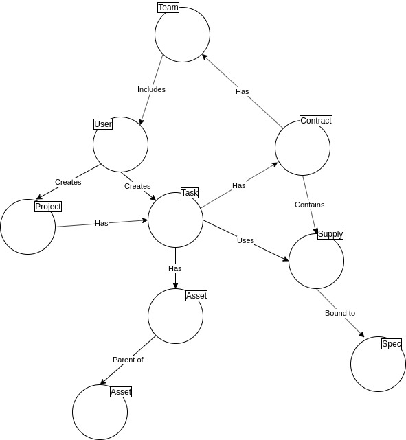

<h1>webSINFRA</h1>

  webSINFRA é o sistema de gestão de manutenção da Secretaria de Infraestrutura do Senado Federal.

<h2>Arquitetura</h2>

  O webSINFRA é desenvolvido como uma <a href="https://en.wikipedia.org/wiki/Web_application">aplicação web</a>, e os diretórios deste repositório (📁database, 📁backend e 📁frontend) correspondem às<a href="https://en.wikipedia.org/wiki/Multitier_architecture"> três camadas</a> de sua arquitetura.

<h3>Banco de Dados (📁database)</h3>

  O sistema gerenciador de banco de dados relacional (RDBMS) é o <a href="https://www.postgresql.org/">PostgreSQL</a>.
  São consideradas as seguintes entidades:

<table>
  <thead>
    <tr>
      <th>Entidade</th>
      <th>Função no sistema</th>
    </tr>
  </thead>
  <tbody>
    <tr>
      <td>Task</td>
      <td>Tarefa, que registra uma ação necessária pela SINFRA, geralmente com a utilização de mão-de-obra, material ou serviço de algum contrato.</td>
    </tr>
    <tr>
      <td>Asset</td>
      <td>Ativo (qualquer imóvel listado no manual de endereçamento desenvolvido pela arquitetura) ou equipamento/subsistema de algum dos sistemas cuja manutenção é realizada pela SINFRA (como elevadores, aparelhos de ar-condicionado, geradores, quadros elétricos etc.). As relações entre um ativo e outro servem para indicar a localização de um ativo (em que sala está determinado aparelho?) ou a hierarquia entre eles (tal quadro elétrico é alimentado por qual estação transformadora?).</td>
    </tr>
    <tr>
      <td>Contract</td>
      <td>Contrato (ou projeto de contratação) com fiscalização ou gestão realizadas pela SINFRA.</td>
    </tr>
    <tr>
      <td>Person</td>
      <td>Usuário do CMMS (efetivos, comissionados, terceirizados).</td>
    </tr>
    <tr>
      <td>Spec</td>
      <td>Especificação técnica de um suprimento.</td>
    </tr>
    <tr>
      <td>Supply</td>
      <td>Suprimento (material ou serviço) vinculado a um contrato, com respectivos preço unitário e quantitativo, e que possui uma especificação técnica.</td>
    </tr>
    <tr>
      <td>Team</td>
      <td>Equipe, grupo de usuários do CMMS responsável por alguma ação pendente em uma tarefa.</td>
    </tr>
    <tr>
      <td>Project</td>
      <td>Agrupa várias tarefas para alguma atividade da SINFRA que necessita da utilização de vários contratos e/ou tarefas.</td>
    </tr>
  </tbody>
</table>

  A imagem abaixo ilustra as principais relações entre as entidades existentes no banco de dados:

  

  Essas entidades, bem como as relações existentes entre elas, são registradas no banco de dados, conforme definições dadas em: <a href="./database/tables.sql">/database/tables.sql</a>. As relações que somente podem assumir os valores de 1:0 ou 1:1 são mapeadas como atributos de uma entidade (colunas de uma tabela, por exemplo, a coluna project_id da tabela tasks, que indica se uma tarefa pertence a um projeto). As relações que podem assumir os valores 1:N são mapeadas como linhas de uma tabela de associação (por exemplo, a tabela task_assets, que contém os ativos vinculados a cada tarefa).

  Relações entre as entidades registradas em tabelas de associação:

<table>
  <thead>
    <tr>
      <th>Entidade</th>
      <th>Entidade</th>
      <th>Relação</th>
      <th>Detalhes</th>
    </tr>
  </thead>
  <tbody>
    <tr>
      <td>Asset</td>
      <td>Asset</td>
      <td>1:(1 a N)</td>
      <td>Define uma relação hierárquica entre os ativos.</td>
    </tr>
    <tr>
      <td>Task</td>
      <td>Asset</td>
      <td>1:(1 a N)</td>
      <td>Define os ativos que estão vinculados a uma determinada tarefa.</td>
    </tr>
    <tr>
      <td>Task</td>
      <td>Supplies</td>
      <td>1:(0 a N)</td>
      <td>Define os suprimentos que serão utilizados na execuçao de determinada tarefa.</td>
    </tr>
    <tr>
      <td>Team</td>
      <td>Persons</td>
      <td>1:(1 a N)</td>
      <td>Define as pessoas que pertencem a uma determinada equipe.</td>
    </tr>
  </tbody>
</table>

  Convenções e estratégias utilizadas:
  <ol>
    <li>Nomes das funções: padronizar e diferenciar em relação </li>
    <li>Operações realizadas pelas funções: correspondem às operações disponibilizadas na interface ao usuário</li>
    <li>Business rules e checagens necessárias para integridade dos dados triggers</li>
  </ol>
  Algumas das funções:
  <table>
    <thead>
      <tr>
        <th>Nome da função</th>
        <th>Descrição</th>
        <th>Momento da execução</th>
        <th>Operações realizadas</th>
      </tr>
    </thead>
    <tbody>
      <tr>
        <td>
          insert_task
        </td>
        <td>
          Função que cria uma tarefa.
        </td>
        <td>
          Quando o usuário envia os dados inseridos no formulário de cadastro de uma nova tarefa.
        </td>
        <td>
          Afeta as tabelas da entidade Task e outras a ela relacionadas (por exemplo, task_assets e task_supplies).
        </td>
      </tr>
      <tr>
        <td>
          modify_task
        </td>
        <td>
          Função que altera uma tarefa.
        </td>
        <td>
          Quando o usuário envia os dados inseridos no formulário de edição de uma tarefa previamente criada.
        </td>
        <td>
          Afeta as tabelas da entidade Task e outras a ela relacionadas (por exemplo, task_assets e task_supplies).
        </td>
      </tr>
      <tr>
        <td>
          check_task_supply
        </td>
        <td>
          Trigger que verifica se o suprimento pode ser vinculado a uma tarefa.
        </td>
        <td>
          Antes da inserção (ou atualização) de uma linha na tabela task_supplies.
        </td>
        <td>
          Somente permite a inserção (ou atualização) da tabela task_supplies caso as três verificações sejam realizadas com sucesso: (1) existe saldo suficiente para o suprimento; (2) os valores decimais da quantidade selecionada para o suprimento não estão em desacordo com a sua especificação técnica (há suprimentos que somente permitem valores inteiros); e (3) o contrato vinculado à tarefa é o mesmo que contém o suprimento em questão.
        </td>
      </tr>
    </tbody>
  </table>

  Os testes das rotinas que permitem os usuários realizarem alterações no banco de dados 
  (por exemplo, criação ou atualização de uma tarefa) e seus respectivos triggers de checagem são encontrados em <a href="./backend/tests">/backend/tests.</a>

<h3>Back-end (📁backend)</h3>

  O servidor web, desenvolvido em <a href="https://nodejs.org/en/">Node.js</a>, é uma camada intermediária entre o banco de dados e a interface do usuário.
  Suas principais funcionalidades são:

<ul>
  <li>
    expor a página web ao usuário do sistema (protocolo HTTP ou HTTPS);
  </li>
  <li>
    realizar a lógica de autenticação e geração dos cookies de sessão de usuário;
  </li>
  <li>
    executar rotinas periódicas (ex.: backups);
  </li>
  <li>
    manter um sistema de diretórios e arquivos vinculados às entidades do banco de dado (ex.: manuais de equipamentos, fotos de edifícios, plantas arquitetônicas para uma tarefa etc.)
  </li>
</ul>

  Algumas das bibliotecas utilizadas e suas respectivas funções no sistema:

<ul>
  <li>
    <a href="http://expressjs.com/">Express</a>, como framework web para Node.js;
  </li>
  <li>
    <a href="http://www.passportjs.org/">Passport</a>, para autenticação de usuários;
  </li>
  <li>
    <a href="https://www.npmjs.com/package/cookie-session">Cookie-Session</a>, para gerar e gerenciar cookies de sessão de usuários;
  </li>
  <li>
    <a href="https://www.graphile.org/">PostGraphile</a>, como API para queries e mutations em GraphQL ao banco de dados;
  </li>
  <li>
    <a href="https://www.npmjs.com/package/morgan">Morgan</a>, para log de requisições HTTP;
  </li>
  <li>
    <a href="https://www.npmjs.com/package/cron">Cron</a>, para agendar rotinas periódicas necessárias ao back-end;
  </li>
  <li>
    <a href="https://www.npmjs.com/package/graphql-upload">GraphQL-Upload</a>, para leitura de arquivos enviados em uploads;
  </li>
  <li>
    <a href="https://node-postgres.com/">Node-Postgres</a>, como interface de acesso ao banco de dados.
  </li>
</ul>

  No diretório <a href="./backend/tests">/backend/tests</a> são testadas as funções que modificam uma (ou mais) tabela(s) do banco de dados (isto é, que contenham os comandos INSERT, UPDATE ou DELETE), e que são expostas aos usuários do sistema (isto é, as mutations que no front-end serão usadas pelo Apollo-Client). Em alguns casos, a execução de tais funções ativam a execução de alguns triggers de checagem (por exemplo, um trigger que verifica se a quantidade de determinado material que está sendo vinculado a uma tarefa é superior à disponível). Nos casos em que tais triggers impedem a operação, uma exceção é lançada (‘raise exception’), retornando uma mensagem de erro. Os testes elaborados verificam:
  <ul>
    <li>
      (1)	os casos normais (a modificação no banco de dados e o envio da respectiva resposta ao usuário são realizados com sucesso); e
    </li>
    <li>
      (2)	os casos em que um trigger de checagem impede a modificação no banco de dados (uma mensagem de erro adequada é retornada para o usuário).
    </li>
  </ul>

<h3>Front-end (📁frontend)</h3>

  A interface ao usuário é uma página web, desenvolvida com um visual moderno e agradável, navegação intuitiva e responsividade (ajuste automático à largura da tela do dispositivo utilizado pelo usuário).

  A base inicial do código-fonte deste diretório corresponde à single page application (SPA) gerada por meio do <a href="https://create-react-app.dev/">Create React App</a>.

  Os componentes das páginas são criados em <a href="https://reactjs.org/">React</a> e outras bibliotecas compatíveis.

  O gerenciamento do histórico de navegação e roteamento são realizados com o <a href="https://reacttraining.com/react-router/web/guides/quick-start">React-Router</a>.

  <em>Queries</em> e <em>mutations</em> em GraphQL, via APIs da biblioteca <a href="https://www.apollographql.com/docs/react/">Apollo-Client</a>, são usadas para <em>data fetching</em> e criação/atualização de entidades do banco de dados (tarefas, ativos, contratos, especificações técnicas etc.).

<h2>Desenvolvedores</h2>

<ul>
  <li><a href="https://github.com/Serafabr">Serafabr</a></li>
  <li><a href="https://github.com/hzlopes">hzlopes</a></li>
  <li><a href="https://github.com/mathbraga">mathbraga</a></li>
</ul>
