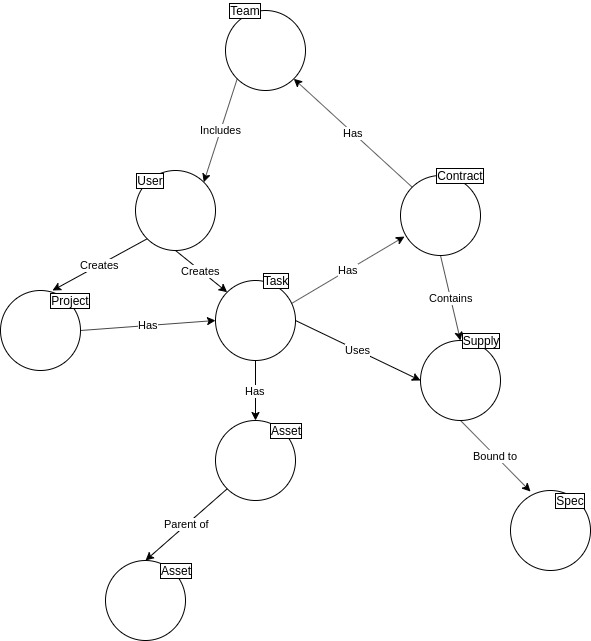

# Tabela de entidades no banco de dados

|Entidade no banco de dados|Função no sistema|
|--------------------------|-----------------|
|Task|Tarefa, que registra uma ação necessária pela SINFRA, geralmente com a utilização de mão-de-obra, material ou serviço de algum contrato. |
|Asset|Ativo (qualquer imóvel listado no manual de endereçamento desenvolvido pela arquitetura) ou equipamento/subsistema de algum dos sistemas cuja manutenção é realizada pela SINFRA (como elevadores, aparelhos de ar-condicionado, geradores, quadros elétricos etc.). As relações entre um ativo e outro servem para indicar a localização de um ativo (em que sala está determinado aparelho?) ou a hierarquia entre eles (tal quadro elétrico é alimentado por qual estação transformadora?).|
|Contract|Contrato (ou projeto de contratação) com fiscalização ou gestão realizadas pela SINFRA.|
|Person|Usuário do CMMS (efetivos, comissionados, terceirizados).|
|Spec|Especificação técnica de um suprimento.|
|Supply|Suprimento (material ou serviço) vinculado a um contrato, com respectivos preço unitário e quantitativo, e que possui uma especificação técnica.|
|Team|Equipe, grupo de usuários do CMMS responsável por alguma ação pendente em uma tarefa.|
|Project|Agrupa várias tarefas para alguma atividade da SINFRA que necessita da utilização de vários contratos e/ou tarefas.|

# Grafo das relações entre as entidades

A imagem abaixo mostra as principais relações entre as entidades existentes no banco de dados.
Como trata-se de um banco de dados relacional (RDBMS), essas relações são registradas por meio de chaves estrangeiras e/ou tabelas de associação (a depender do tipo de relação --> 0 ou 1 para 1 ou muitos).

  

